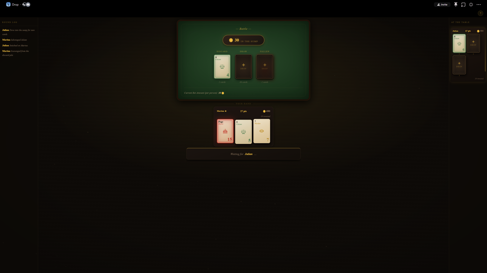
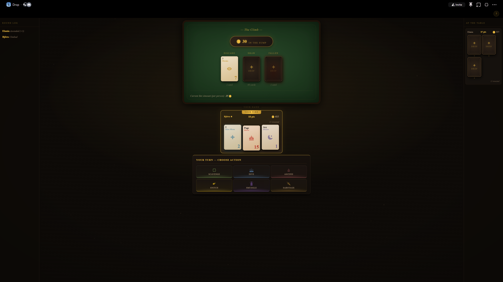
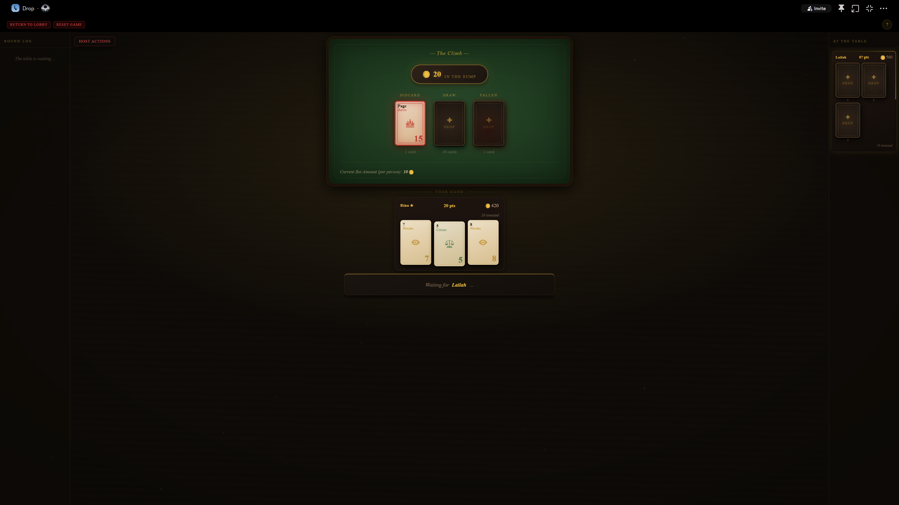
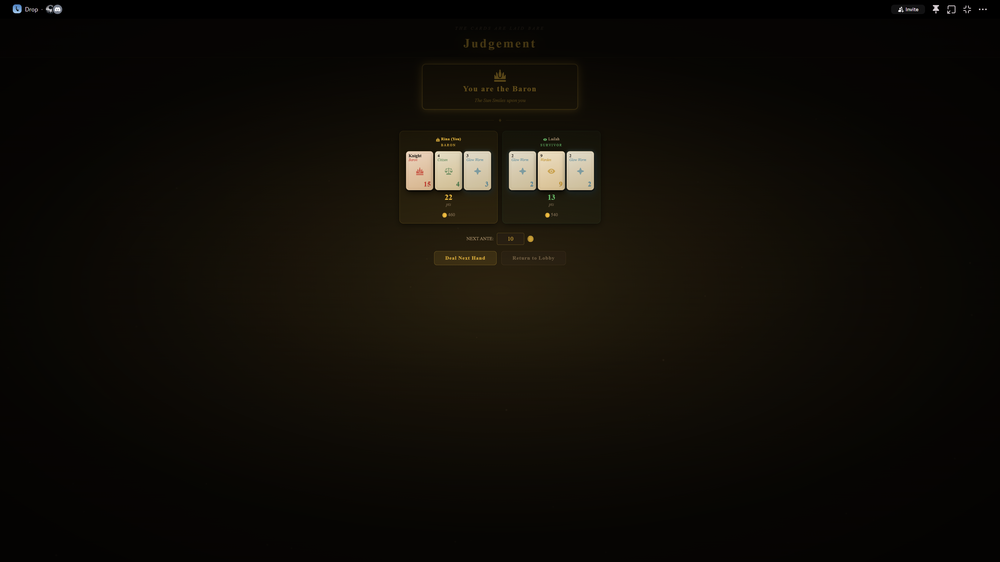

# Drop

A multiplayer card game that runs as a **Discord Embedded Activity** — directly inside a voice channel, no bots or external links needed.

Drop uses the 56-card Minor Arcana as its deck. Players ante into a communal pot called the Sump, take strategic actions across two phases, and compete to hold the highest-scoring hand at Judgement.

---

## Screenshots

**The Climb — taking actions against opponents**




**Active hand with your cards and the board**



**Judgement — Baron vs Survivor payout**



---

## How It Plays

Each hand runs through five phases:

| Phase | What happens |
|---|---|
| **Setup** | Players sit down and the host sets the ante |
| **Feeding the Sump** | Antes are collected into the pot |
| **The Climb** | Two rounds of actions — Scavenge, Dive, Ascend, Snitch, Smuggle, Sabotage |
| **Battle** | A final ascend-only showdown round |
| **Judgement** | Hands are revealed, the highest scorer becomes the Baron and wins the pot |

Card ranks from highest to lowest: **Baron → Warden → Citizen → Glow Worm → Hollow**

Player coin balances persist across hands. Games run per-channel — multiple channels can run independent games simultaneously.

---

## Stack

- **[Robo.js](https://robojs.dev)** — full-stack Discord Activity framework (file-based routing, built-in KV store, WebSocket sync)
- **React 19** + **TypeScript** + **Vite**
- **Flashcore** — Robo.js's built-in key-value store for persisting balances and game state
- **@robojs/sync** — WebSocket pub-sub for real-time state updates across all clients

The entire app runs as a single Node.js process serving both the API and the compiled frontend.

---

## Local Development

**Prerequisites:** Node.js 20+, a Discord Application with Activities enabled

1. Clone the repo and enter the project directory:
   ```bash
   git clone <repo-url>
   cd Drop-Real/Drop
   ```

2. Create a `.env` file:
   ```
   VITE_DISCORD_CLIENT_ID=your_application_id
   DISCORD_CLIENT_SECRET=your_client_secret
   ```

3. Install dependencies and start the dev server:
   ```bash
   npm install
   npm run dev
   ```

   This starts a local server with a Cloudflare tunnel. Paste the tunnel URL into your Discord Application's URL mapping under Activities to test it inside Discord.

---

## Self-Hosted Deployment

The app deploys as a single Node.js process behind Nginx. Full step-by-step instructions are in [`Drop/Deployment.txt`](./Drop/Deployment.txt), but the short version:

```bash
# On your server
npm install
npm run build
pm2 start "npm run start" --name drop
```

Then configure Nginx as a reverse proxy on port 3000 with WebSocket upgrade headers, obtain an SSL certificate via Certbot, and point your Discord Application's URL mapping at your domain.

**Persistent state** lives in `.robo/data/` — do not delete this directory between deploys or player balances will be wiped.

---

## Project Structure

```
Drop/
  src/
    api/        # Server-side routes (file-based, Robo.js)
    app/        # React frontend — views and components
    game/       # Pure game logic, state machine, deck (no framework deps)
    hooks/      # React hooks for Discord SDK and game state
  config/       # Robo.js, Vite, and ESLint config
```

The single write path is `POST /api/game/action`. It acquires a per-channel mutex, resolves the action through the `src/game/actions.ts` state machine, writes to Flashcore, and broadcasts the update to all connected clients via `@robojs/sync`.

---

## Environment Variables

| Variable | Required | Description |
|---|---|---|
| `VITE_DISCORD_CLIENT_ID` | Yes | Discord Application ID. Baked into the frontend at build time — must be set before `npm run build`. |
| `DISCORD_CLIENT_SECRET` | Yes | Discord Client Secret. Used at runtime by the `/api/token` endpoint. |
| `PORT` | No | Override the listen port (default: `3000`). Update the Nginx proxy target to match. |
